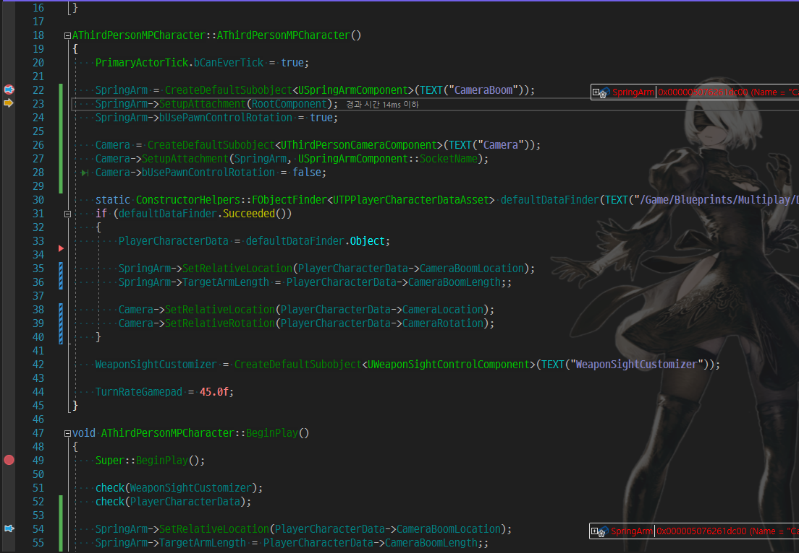
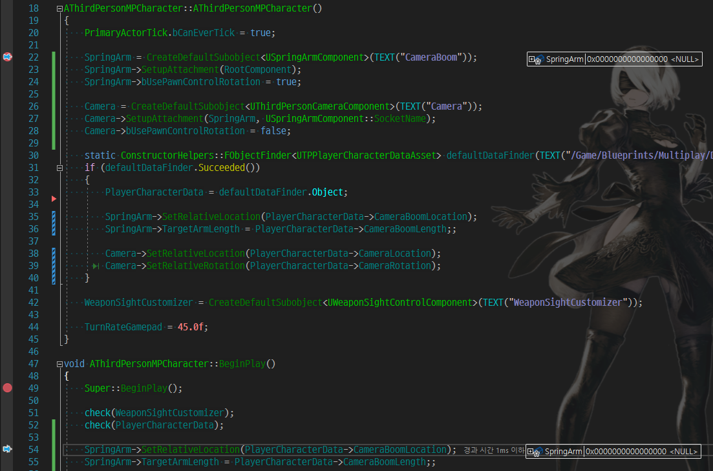
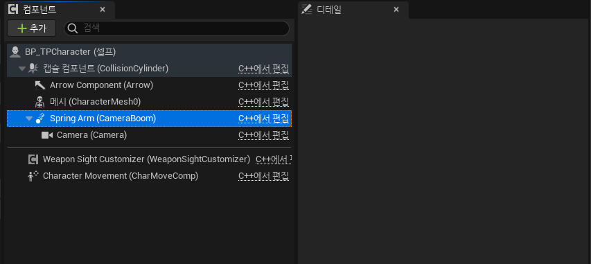
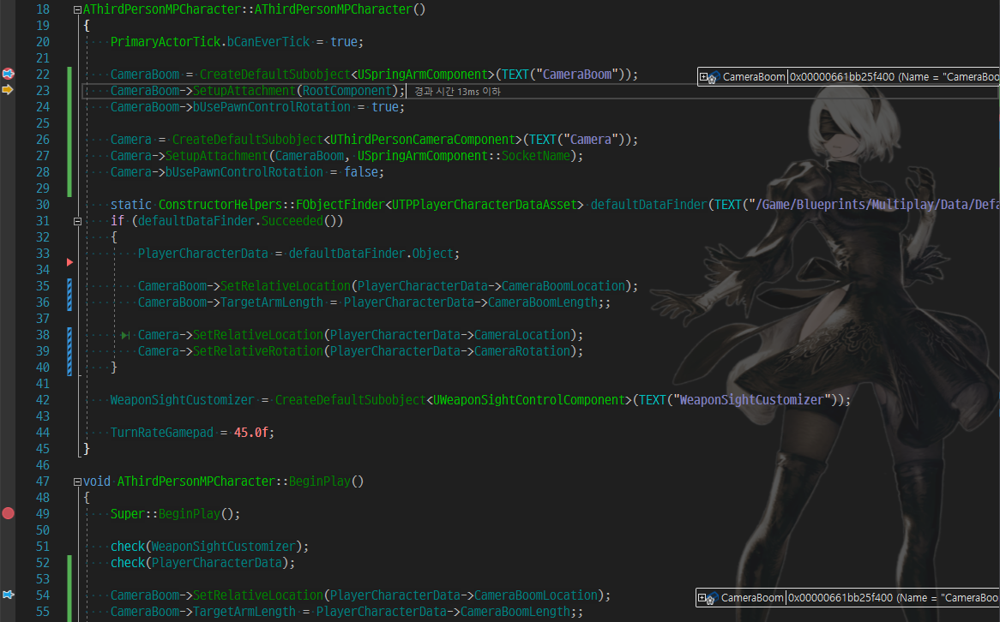
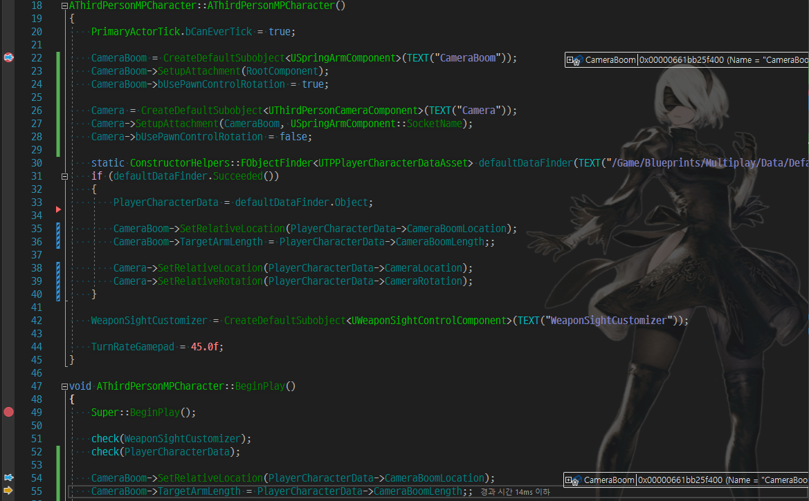
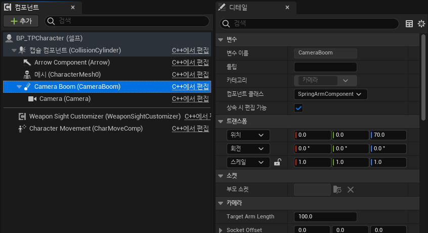

# UPROPERTY UActorComponent Type 멤버 변수가 Nullptr이 되는 문제

## 문제 발생

UActorCompont 를 Constructor 에서 생성 후 다른 곳에서 사용 시 Nullptr로 되어 있는 문제가 발생.

Constructor 에서

BeginPlay 에서

클래스를 상속받은 Blueprint 에서 Component의 Detail 패널에 아무것도 안보임.

## 해결 방법

**변수 이름 변경으로 해결.**

Contructor 에서

BeginPlay 에서

블루 프린트에서도 보여짐

## 원인 추측

Blueprint 에 이전에 사용했던 변수에 대한 정보가 남아있어 충돌이 나는 것이 아닐까 하는 추측.

## 관련 커뮤니티 Thread
