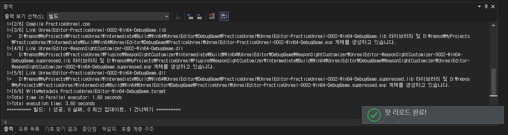

# UnrealEngine 5 에서 Hot reload 가 동작하지 않게 된 건에 대하여

## 문제 발생

Live coding 가 비활성화 된 상태에서 C++ 소스를 Build 하면 일반적으로는 Engine Editor 에서 Hot reload 를 동작 시킴. (Windows OS 한정)




하지만 어느 순간 동작하지 않는 상황이 발생 함.


## 원인

첫 프로젝트를 생성하게 되면 기본적으로 메인 Module 은 FDefaultGameModule 를 사용하게 됨.

**PracticeUnreal.cpp**

```cpp
// Fill out your copyright notice in the Description page of Project Settings.

#include "PracticeUnreal.h"
#include "Modules/ModuleManager.h"

IMPLEMENT_PRIMARY_GAME_MODULE( FDefaultGameModuleImpl, PracticeUnreal, "PracticeUnreal" );
```

기본 Module 을 재 정의 하기 위해 IModuleInterface 를 상속 받아 정의를 해 주었음.

**PracticeUnreal.h**

```cpp
// 2023 Copyright by Stiner

#pragma once

#include "CoreMinimal.h"

DECLARE_LOG_CATEGORY_EXTERN(PracticeUnreal, All, All)

class PRACTICEUNREAL_API FPracticeUnrealModule : public IModuleInterface
{
public:
    virtual void StartupModule() override;
    virtual void ShutdownModule() override;
};
```

**PracticeUnreal.cpp**

```cpp
// 2023 Copyright by Stiner

#include "PracticeUnreal.h"
#include "Modules/ModuleManager.h"

IMPLEMENT_PRIMARY_GAME_MODULE(FPracticeUnrealModule, PracticeUnreal, "PracticeUnreal");

DEFINE_LOG_CATEGORY(PracticeUnreal)

void FPracticeUnrealModule::StartupModule()
{
    // do something
}

void FPracticeUnrealModule::ShutdownModule()
{
    // do something
}
```

그리고 IModuleInterface 내부를 보면

**ModuleInterface.h**

```cpp
// Copyright Epic Games, Inc. All Rights Reserved.


#pragma once

#include "CoreTypes.h"


/**
 * Interface class that all module implementations should derive from.  This is used to initialize
 * a module after it's been loaded, and also to clean it up before the module is unloaded.
 */
class IModuleInterface
{

public:

    //-----
    // 이런저런 코드들..
    //-----

    /**
     * Returns true if this module hosts gameplay code
     *
     * @return True for "gameplay modules", or false for engine code modules, plugins, etc.
     */
    virtual bool IsGameModule() const
    {
        return false;
    }
};
```

여기에서 IModuleInterface 의 IsGameModuel() 함수를 override 하지 않은 채로 false 를 return 시키면 Hot reload 가 동작하지 않게 됨. 이름 그대로 true를 return 해서 게임모듈로 인식 시켜야 함.

## 해결

1. FDefaultGameModule 을 상속 받아 사용한다.
   - FDefaultGameModule 에서는 IsGameModule() 을 true 로 return 되도록 override 되어 있음.
2. IModuleInterface 을 사용하게 된다면 IsGameModuel() 을 override 하여 true를 return 하도록 재 정의 해 준다.
   
   **PracticeUnreal.h**
   
   ```cpp
   // 2023 Copyright by Stiner
   
   #pragma once
   
   #include "CoreMinimal.h"
   
   DECLARE_LOG_CATEGORY_EXTERN(PracticeUnreal, All, All)
   
   class PRACTICEUNREAL_API FPracticeUnrealModule : public IModuleInterface
   {
   public:
       virtual void StartupModule() override;
       virtual void ShutdownModule() override;
   
       virtual bool IsGameModule() const override { return true; };
   };
   ```
