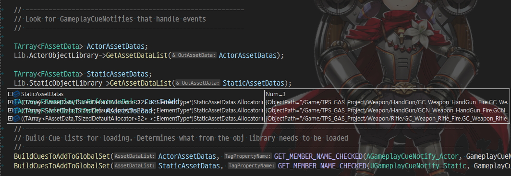

# GameplayCueManager 초기화 부분 분석

## 개요

GameplayCueManager에 CueNotify 가 언제 등록이 되는지 확인하기 위해 GameplayCueManager의 초기화 시점을 분석하게 됨.

## 초기화 과정

1. 엔진 초기화 시점에 AbilitySystemGlobals(Singleton) 전역 Instance 초기화
   GameplayCue 를 쓰게 된다면 반드시 InitGlobalData() 를 엔진 초기화 과정에서 호출 해 줘야 정상 동작하게 됨.
   
   ```cpp
   void MyAssetManager::InitializeAbilitySystem()
   {
       SCOPED_BOOT_TIMING("UTPS_AssetManager::InitializeAbilitySystem");
   
       UE_LOG(LogTemp, Log, TEXT("InitializeAbilitySystem"));
       UAbilitySystemGlobals::Get().InitGlobalData();
   }
   ```

2. 내부에서 각종 Singleton 전역 Instance 초기화
   
   ```cpp
   void UAbilitySystemGlobals::InitGlobalData()
   {
       GetGlobalCurveTable();
       GetGlobalAttributeMetaDataTable();
   
        InitAttributeDefaults();
   
        GetGameplayCueManager();
        GetGameplayTagResponseTable();
        InitGlobalTags();
   
        InitTargetDataScriptStructCache();
   
        // Register for PreloadMap so cleanup can occur on map transitions
        FCoreUObjectDelegates::PreLoadMap.AddUObject(this, &UAbilitySystemGlobals::HandlePreLoadMap);
   
    #if WITH_EDITOR
        // Register in editor for PreBeginPlay so cleanup can occur when we start a PIE session
        if (GIsEditor)
        {
            FEditorDelegates::PreBeginPIE.AddUObject(this, &UAbilitySystemGlobals::OnPreBeginPIE);
        }
    #endif
   }
   ```

3. RuntimeGameplayCueObjectLibrary.Paths(default : "/Game") 기준으로 InitializeObjectLibrary 내에서 에셋들을 전부 스캔하여 UGameplayCueManager(Singleton)에 등록.
   
   ```cpp
   void UGameplayCueManager::InitializeRuntimeObjectLibrary()
   {
       UE_SCOPED_ENGINE_ACTIVITY(TEXT("Initializing GameplayCueManager Runtime Object Library"));
   
       RuntimeGameplayCueObjectLibrary.Paths = GetAlwaysLoadedGameplayCuePaths();
       if (RuntimeGameplayCueObjectLibrary.CueSet == nullptr)
       {
           RuntimeGameplayCueObjectLibrary.CueSet = NewObject<UGameplayCueSet>(this, TEXT("GlobalGameplayCueSet"));
       }
       RuntimeGameplayCueObjectLibrary.CueSet->Empty();
       RuntimeGameplayCueObjectLibrary.bHasBeenInitialized = true;
   
       RuntimeGameplayCueObjectLibrary.bShouldSyncScan = ShouldSyncScanRuntimeObjectLibraries();
       RuntimeGameplayCueObjectLibrary.bShouldSyncLoad = ShouldSyncLoadRuntimeObjectLibraries();
       RuntimeGameplayCueObjectLibrary.bShouldAsyncLoad = ShouldAsyncLoadRuntimeObjectLibraries();

       InitObjectLibrary(RuntimeGameplayCueObjectLibrary);
   }
   ```
   
   InitObjectLibrary() 중.
   
   

## 기타

DefaultGame.ini 에서 UAbilitySystemGlobals를 상속한 Class를 지정하여 커스텀 가능

```ini
[/Script/GameplayAbilities.AbilitySystemGlobals]
AbilitySystemGlobalsClassName=/Script/TPS_GAS_Project.TPS_AbilitySystemGlobals
+GameplayCueNotifyPaths="/Game/GameplayCueNotifies/Characters"
```
