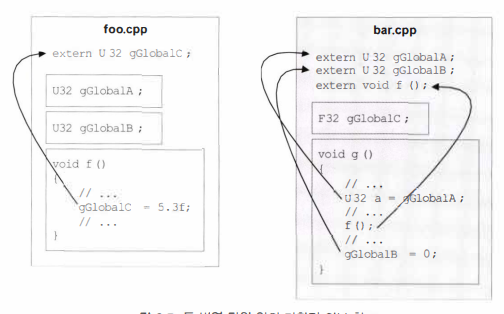
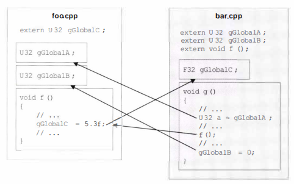
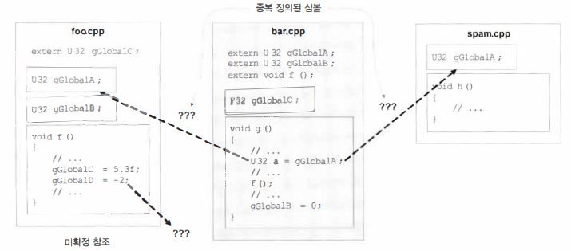

# 스터디 그룹

## 스터디 한 것

게임엔진 아키텍처 3판 3장 - "게임을 위한 소프트웨어 엔지니어링 기초" 중

## 데이터, 코드, 메모리 레이아웃

### 킬로바이트 vs 키비바이트

메모리 용량을 나타내는 단위.

프로그래머 사이에서 보통 킬로바이트 하면 1024바이트.

국제단위계(SI) 기준의 킬로는 103로 정의 1024 가 아님.

국제전기기술위원회(IEC)에서 새로운 접두사 공표. 10의 지수가 아닌 2의 지수로 정의.

킬로(1,000바이트)->키비(1,024바이트), 메가(1,000,000)->메비(1,024x1,024=1,048,576바이트)

#### SI

| Value | Unit | Name |
|--|--|--|
| 1000 | kB | kilobyte |
| 10002 | MB | megabyte |
| 10003 | GB | gigabyte |
| 10004 | TB | terabyte |

#### IEC

| Value | Unit | Name |
|--|--|--|
| 1024 | KiB | kibibyte |
| 10242 | MiB | mebibyte |
| 10243 | GiB | gibibyte |
| 10244 | TiB | tebibyte |

### 선언, 정의, 연결성

#### 번역 단위 다시 살펴보기

C/C++는 여러 번역단위로 이루어 짐.

Compiler가 .cpp 파일 1개를 번역하면 결과물로 Object 파일 1개 생성. .cpp 1개는 Compiler가 번역하는 제일 작은 단위이며 이를 번역단위라고 함.

Object 파일에는 정의된 모든 함수를 번역한 기계어 뿐만 아니라 그 파일 안의 모든 전역 변수와 정적 변수도 담고 있음.

이 외에 다른 번역단위에 정의된 함수를 가리키는 "**미확정 참조**unresolved references"를 담기도 함.

Compiler는 한번에 1개의 번역단위만 처리하기 때문에 외부 전역변수나 함수 처리시 있다고 가정하고 번역을 진행 함.

이렇게 나온 Object 파일들을 모아서 완성된 실행파일로 만드는 것은 Linker 의 몫.

이 과정에서 미확정 참조의 실체를 알아내려 시도, 성공하면 모든 전역변수, 정적변수, 번역단위 간 참조가 전부 포함된 실행파일이 만들어짐.

이 과정에서 Linker가 낼 수 있는 에러는 두가지.

1. extern 으로 선언된 외부 참조를 못 찾은 경우. - "미확정 심볼unresolved symbol
2. 이름이 같은 변수나 함수(정확히는 심볼)을 2개 이상 발견. - 중복 정의된 심볼multiply defined symbol

